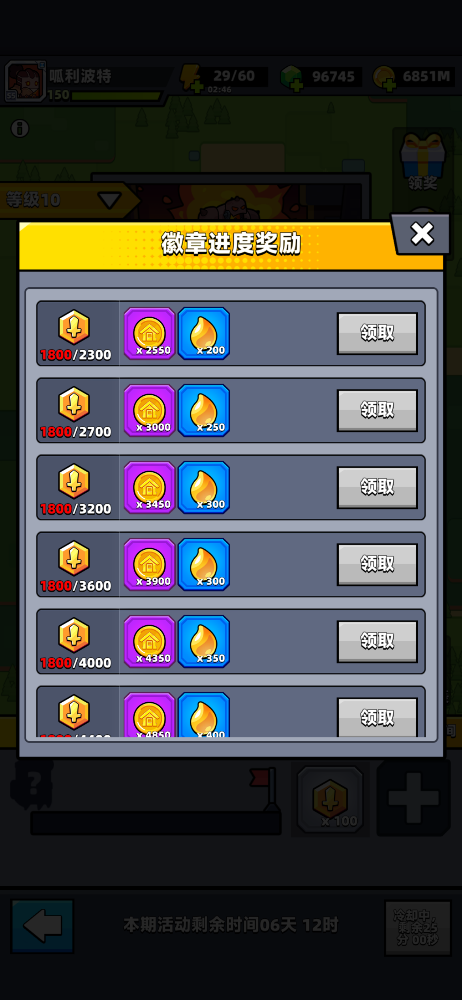
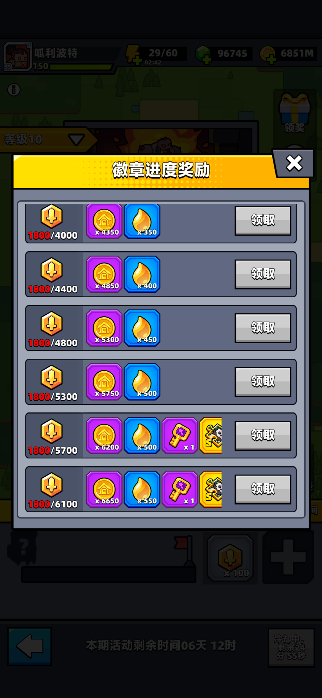

{type=banner}

## 探索重制：挂机派遣新时代

公会探索玩法迎来了一次颠覆性的改版！全新重制后的系统将过去的繁琐日常挑战，升级为了**轻量化的全自动派遣挂机机制**。
新版玩法不仅大幅缩减了在线操作时间，让游玩节奏更加自由，同时**每周的宝箱福利与 Boss 战奖励也迎来了史诗级提升**。下面，呱呱就为大家拆解新版探索的通关策略与核心收益！

---

## 策略指南：高效探索三步走

新版公会探索的通关秘诀可以总结为三步：**科学派遣特工、点击加速、合力击杀Boss**。

{type=card}

### 💡 第一步：科学派遣
* **特工数量与时间**：每次最多可同时执行 **4** 个挂机任务。建议白天利用碎片时间派驻**短时长**任务以提高周转率，夜晚临睡前则直接安排**长时长**任务。
* **属性标签加成**：选择特工时，必须注意任务要求的“属性小标签”（例如“长发特工”、“非人特工”等），派驻匹配标签的特工可以获得高额提速增益，首选 S级特工。
* **避坑**：目前版本中，SP级特工在派遣时间上存在显示 Bug（界面显示 5 小时但实际执行需 10 小时），在官方修复之前，建议优先派遣普通 S级特工。
* **节约时间技巧**：在派遣前，可以将空闲特工用碎片升至 **6星** 获得最大派遣加成，任务结束后再退回碎片，实现无损节约时间。

### ⚡第二步：点击加速
* 派遣开始后，界面右下角会开启**“加速”**功能。
* **每30分钟**每位成员均可手动加速一次。建议人数不足的公会，管理在群内组织统一组织点加速，能成倍缩短挂机等待时长。
* 公会每赛季（一周）总计 **420** 个派遣指标，按公会 40 人满员计算，**人均每周仅需派遣 11 次**即可无压力达成。

### ⚔️ 第三步：击杀Boss
* 任务进度拉满后，将解锁最终的探索首领（Boss）挑战。
* **全员强制参与**：公会所有成员**必须至少挑战一次首领**！未打 Boss 的玩家在赛季结算时将无法领取任何累积宝箱！
* **成绩与晋级**：首领挑战成功后下周自动升级难度，难度越高，奖励越丰厚。

> 按照目前的改版的情况，探索奖励已经超过了远征，大家一定积极参与。

---

## 探索首领宝箱奖励明细
公会探索的核心福利来自首领挑战解锁的 **10 个进度宝箱**。呱呱特别整理了每个宝箱的详细奖励配置：

| 宝箱档位 | 所需积分 | 公会币奖励 | 能量精华 | 其他稀有道具奖励 |
| :---: | :---: | :---: | :---: | :--- |
| 1 | 600 | +3800 | +300 | - |
| 2 | 1300 | +4500 | +350 | - |
| 3 | 2100 | +5200 | +450 | - |
| 4 | 3000 | +5850 | +500 | - |
| 5 | 4050 | +6550 | +550 | - |
| 6 | 5200 | +7250 | +600 | - |
| 7 | 6450 | +7950 | +650 | - |
| 8 | 7800 | +8650 | +700 | - |
| 9 | 9250 | +9300 | +800 | {{零件钥匙}} x1 \| {{s级特工碎片}} x2 \| {{核心自选宝箱精华}} x1 |
| 10 | 10800 | +10000 | +850 | {{零件钥匙}} x3 \| {{s级特工碎片}} x2 \| {{核心自选宝箱精华}} x3 |
| **合计** | - | +69050 | +5750 | {{零件钥匙}} x4 \| {{s级特工碎片}} x4 \| {{核心自选宝箱精华}} x4 |

如果公会成员保持活跃，每周均将 10 个首领宝箱和徽章进度奖励全部拿满，那么全公会特工的**月度累积收益**将极为惊人：

* **公会币总计**：**460,200** 币 (包含首领宝箱 276,200 + 进度奖励 184,000)
* **能量精华总计**：**38,200** 精华 (包含首领宝箱 23,000 + 进度奖励 15,200)
* **探索钥匙总计**：**24** 把 (包含首领宝箱 16 + 进度奖励 8)
* **S级特工自选碎片**：**24** 片 (包含首领宝箱 16 + 进度奖励 8)
* **神炼核心/核心自选箱精华**：**20** 片 (包含首领宝箱 16 + 进度奖励 4)

### 探索进度奖励

除了首领宝箱外，公会成员全员累积的探索徽章进度也有一份丰厚奖励。根据当前关卡等级可见的徽章进度宝箱奖励详情如下：

| 徽章点数 | 公会币奖励 | 能量精华 | 其他稀有道具奖励 |
| :---: | :---: | :---: | :--- |
| **2300** | +2550 | +200 | - |
| **2700** | +3000 | +250 | - |
| **3200** | +3450 | +300 | - |
| **3600** | +3900 | +300 | - |
| **4000** | +4350 | +350 | - |
| **4400** | +4850 | +400 | - |
| **4800** | +5300 | +450 | - |
| **5300** | +5750 | +500 | - |
| **5700** | +6200 | +500 | {{零件钥匙}} x1 \| {{s特工碎片}} x1  |
| **6100** | +6650 | +550 | {{零件钥匙}} x1 \| {{s特工碎片}} x1 \| {{核心自选宝箱精华}} x1 |
| **合计** | +46000 | +3800 | {{零件钥匙}} x2 \| {{s特工碎片}} x2 \| {{核心自选宝箱精华}} x1 |

{type=grid2}
{type=grid2}

{{往期推荐}}
{{扫码获取更多精彩}}

---

【免责声明】本攻略纯属个人**经验分享**，**仅供参考**，不构成任何消费建议。游戏版本更新较快，具体数值以游戏内实际表现为准。本攻略所引用的美术图片及游戏内截图版权均归 Habby 公司所有。

以上就是本篇攻略的所有内容了，如果你觉得这篇攻略对你有帮助，别忘了**点赞和关注**哦！这对我非常重要！你们的支持是我创作的最大动力。对攻略有疑问或者有更好的建议，欢迎在下方**评论区留言**，我们下期再见！