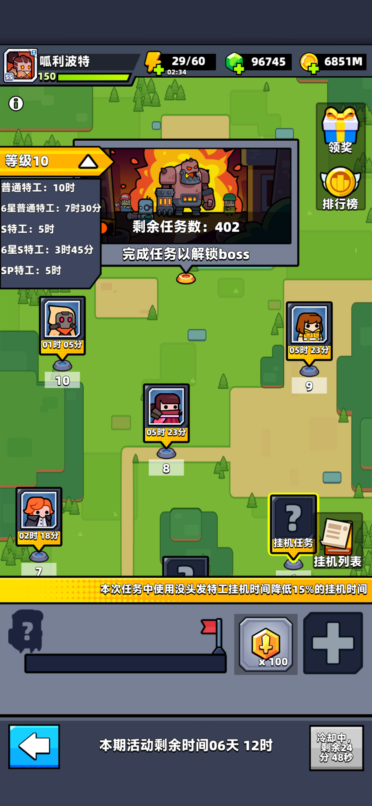

{type=banner}

## 派遣特工：小标签，大效率

公会探索重置后，全新上线的**自动挂机派遣机制**已成为公会获取公会币、特工碎片及核心获取的核心渠道。

在派遣挂机任务时，每个任务都有特定的**特征标签要求**（例如：**男性特工**、**女性特工**、**非人类特工**、**长发特工**、**短发特工**、**没头发特工**）。

> **核心加成**：派遣完全符合任务特征的特工执行，可以**直接减少 <strong>15%</strong> 的任务耗时**！
> 
> 配合公会群全员一键加速，能让挂机效率翻倍。今天呱呱就将全游戏现有的 **24 位特工**按照这六大特征标签进行归纳，方便大家在派遣时一秒锁定！

---

## 24 位特工特征标签大盘点

{type=card}

### 1. 男性特工
男性特工在游戏中共有 **6 位**：
* {{乔伊}} 乔伊、{{科萌}} 科萌、{{哪吒}} 哪吒、{{维托尔}} 维托尔、{{沃尔默}} 沃尔默、{{威彻}} 威彻

### 2. 女性特工
女性特工共有 **7 位**：
* {{塔洛西娅}} 塔洛西娅、{{艾琳娜}} 艾琳娜、{{伏尔甘}} 伏尔甘、{{月咏}} 月咏、{{凛音}} 凛音、{{金}} 金、{{爱普莉尔}} 爱普莉尔

### 3. 非人类特工 
非人类特工在游戏中共有 **11 位**：
* {{杨大师}} 杨大师、{{凯蒂斯}} 凯蒂斯、{{斯普林特}} 斯普林特、{{莱昂纳多}} 莱昂纳多、{{拉斐尔}} 拉斐尔、{{多纳泰罗}} 多纳泰罗、{{米开朗基罗}} 米开朗基罗、{{海绵宝宝}} 海绵宝宝、{{派大星}} 派大星、{{章鱼哥}} 章鱼哥、{{珊迪}} 珊迪

### 4. 长发特工 
长发特工在游戏中共有 **8 位**：
* {{乔伊}} 乔伊、{{月咏}} 月咏、{{凛音}} 凛音、{{塔洛西娅}} 塔洛西娅、{{伏尔甘}} 伏尔甘、{{哪吒}} 哪吒、{{爱普莉尔}} 爱普莉尔、{{金}} 金

### 5. 短发特工 
短发特工在游戏中共有 **3 位**：
* {{艾琳娜}} 艾琳娜、{{科萌}} 科萌、{{沃尔默}} 沃尔默

### 6. 没头发特工
没头发特工在游戏中共有 **11 位**：
* {{杨大师}} 杨大师、{{凯蒂斯}} 凯蒂斯、{{斯普林特}} 斯普林特、{{珊迪}} 珊迪、{{海绵宝宝}} 海绵宝宝、{{派大星}} 派大星、{{章鱼哥}} 章鱼哥、{{莱昂纳多}} 莱昂纳多、{{拉斐尔}} 拉斐尔、{{多纳泰罗}} 多纳泰罗、{{米开朗基罗}} 米开朗基罗

> 话说官方对这些特工特征的划分标准，真是充满了“脑洞”！
> 比如大红皮肤、满身腱子肉与合金装甲的硬核机械人 {{伏尔甘}} 伏尔甘，居然被官方判定为了**女性特工**；
> 更绝的是，毛茸茸的国宝熊猫 {{杨大师}} 杨大师、可爱猫咪 {{凯蒂斯}} 凯蒂斯、松鼠 {{珊迪}} 珊迪 还有老鼠 {{斯普林特}} 斯普林特，明明个个浑身长满了毛，却因为“没有人类头发生长”被系统全员判定成了 **「没头发」**！
> 你对官方的分类有什么看法吗？评论区聊聊你的想法吧！

---

## 派遣建议

1. **单日派遣限制**：请记住，**每天同一位特工只能派遣一次**！在每天派遣前，必须根据当天的任务池，合理规划好每位特工的去向。
2. **特工池与活跃度**：玩家解锁的特工数量越多，面对各种奇葩特征要求的可调配空间就越大；越活跃的玩家，能完成的任务就越多。因此，多开特工是提升探索进度的硬道理。
3. **合理安排时间作息（特别推荐低活跃公会）**：
   * **白天安排 S级特工**：S级特工基础派遣时间短、效率高。白天玩家在线时派遣 S级特工，可以快速完成任务并及时享受到公会成员的点击加速，做到高频周转。
   * **夜晚安排 普通特工**：普通特工耗时较长。建议在临睡前将普通特工派去执行超长挂机任务，利用夜间睡眠时间慢慢跑进度，完全不耽误白天的黄金派遣时间。
4. **同调与升星技巧**：如果派遣主力特工星级较低，可以降低同调等级，并利用“退回碎片”将空闲特工临时升至 **6星** 拿满缩短时长加成，任务完成后再退回资源降星，实现资源利用最大化。

{{往期推荐}}

{{扫码获取更多精彩}}

【免责声明】本攻略纯属个人**经验分享**，**仅供参考**，不构成任何消费建议。游戏版本更新较快，具体数值以游戏内实际表现为准。本攻略所引用的美术图片及游戏内截图版权均归 Habby 公司所有。

以上就是本篇攻略的所有内容了，如果你觉得这篇攻略对你有帮助，别忘了**点赞和关注**哦！这对我非常重要！你们的支持是我创作的最大动力。对攻略有疑问或者有更好的建议，欢迎在下方**评论区留言**，我们下期再见！
