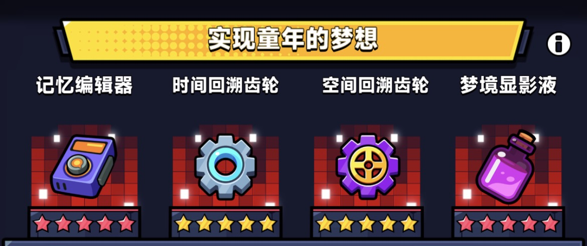

宠物系统是弹壳特攻队中非常重要的战力提升来源，尤其是**S宠物**解锁后，可以大幅提升输出。本篇攻略将系统梳理宠物培养的核心机制与最优策略。

---

## 一、如何解锁S宠物？

解锁条件：**将任意 4 只同类型的普通宠物觉醒至 5[黄星](img://黄星){type=icon}**。

> 注意：解锁S宠物后，那 4 只用于解锁的普通宠物必须**始终保持在 5[黄星](img://黄星){type=icon} 状态**，否则将无法切换使用S宠物。

---

## 二、普通宠物该用哪只？

在未解锁S宠物阶段，建议优先使用**老鹰**[老鹰](img://老鹰){type=icon}宠物，它是早期性价比最高的普通宠物（推荐在战力约 25 万时使用）。一旦解锁S宠物，即可切换为S宠物。

---

## 三、S宠物该用哪只？

目前游戏内共有 **6 只S宠物**（未来也许会有 7 只），每只都拥有专属技能体系。**当前版本综合评价首推的是「加肥喵」** [加肥喵](img://加肥喵){type=icon}。

### 各S宠物技能一览（强度从强到弱排列）

| S宠物 | 主动技能 1 | 主动技能 2 |
|---|---|---|
| **加肥喵** [加肥喵](img://加肥喵){type=icon} | 餐前甜点：经常在周围出现甜甜圈光环 | 甜品光环：释放甜品光环，对范围内的敌人造成伤害持续10秒 |
| **松鼠** [松鼠](img://松鼠){type=icon} | 双色坚果：向敌人发射棕色坚果 | 坚果爆炸：发射爆炸性的火焰坚果持续10秒 |
| **企鹅** [企鹅](img://企鹅){type=icon} | 雪球高手：发射雪球 | 紧急冰冻：召唤雪雾持续10秒，给范围内敌人造成伤害 |
| **卡皮** [卡皮](img://卡皮){type=icon} | 流浪长剑：向敌人发射木剑波 | 魔化解放：变身10秒，释放魔剑坠落，变身时发射魔化剑气 |
| **河豚** [河豚](img://河豚){type=icon} | 神经毒素：释放神经毒素光环，对范围内敌人持续造成伤害附带中毒和衰弱效果 | 河豚圆鼓鼓：变得愤怒肥大，释放持续10秒的致命毒素光环 |
| **咕咕鸡** [咕咕鸡](img://咕咕鸡){type=icon} | 羽毛连击：向敌人发射羽毛 | 怒火骤雨：进入狂怒状态，向一定范围内的敌人发射火焰羽毛，持续10秒 |

---

## 四、为什么出战宠物和助战宠物要选同一只？

这是培养效率最高的策略，核心原因如下：

- **觉醒进度共享**：相同S宠物之间共用觉醒进度，因此若你的主力S宠物已觉醒至 5[红星](img://红星){type=icon}，同类型的助战S宠物也会同步达到相同星级，**大幅节省觉醒所需的消耗资源**。
- **助战技能与共鸣率加成**：S宠物在更高觉醒星级下，能为助战位提供更多的**伤害加成与共鸣率加成**。

---

## 五、出战宠物 vs 助战宠物，有什么区别？

| 类型 | 技能说明 |
|---|---|
| **出战宠物** | 主动技能全部生效，包括专属的进攻技能 |
| **助战宠物** | 仅助战技能生效，主动技能不触发 |

> 例如：攻击类主动技能**仅在宠物处于出战状态时才能激活**，助战时无效。

---

## 六、如何解锁全部助战槽位？

| 槽位 | 解锁条件 |
|---|---|
| 第 1、2 助战槽 | 解锁S宠物后自动开启 |
| 第 3 助战槽 | 累计消耗 **21 个异宠核心** [异宠核心](img://异宠核心){type=icon} |
| 第 4 助战槽 | 累计消耗 **50 个异宠核心** [异宠核心](img://异宠核心){type=icon} |
| 第 5 助战槽 | 累计消耗 **90 个异宠核心** [异宠核心](img://异宠核心){type=icon} |
| 第 6 助战槽 | 暂未开放 |

---

## 七、最优助战技能优先级

助战技能的选择直接决定了特工和宠物的输出。根据最新实战数据与测试，最优的助战技能梯队与搭配建议如下：

### 1. 助战技能强度梯队 

| 梯队  | 助战技能 | 属性说明 |
| :---: | :---: | :--- |
|  **T0 级** | **共鸣伤害 / 共鸣增幅** | **共鸣伤害**：{{共鸣伤害}} 提升助战位共鸣伤害。 **共鸣增幅**：{{共鸣增幅}} 提升助战位共鸣概率,5{{红星}}弄3只就能达到上限 100%。 |
|  **T1 级** | **盾伤** | **盾伤**{{盾伤}}：自身存在护盾时，对敌人造成额外百分比伤害。 |
|  **T2 级** | **百分比攻击** | **百分比攻击**{{百分比攻击}}：直接提升特工百分比攻击力。 |
|  **T3 级** | **异伤（毒/衰/冰）** | 包含[中毒](img://中毒){type=icon}**中毒**、[衰弱](img://衰弱){type=icon}**衰弱**、[冰缓](img://冰缓){type=icon}**冰缓**。（三者在伤害乘区中属于同一类别，会相互稀释） |
| ❌ **D 级** | **生存与移速类** | 包含：[生命值百分比](img://生命值百分比){type=icon}**生命值百分比**、[最终生命](img://最终生命){type=icon}**最终生命**、[共鸣加速](img://共鸣加速){type=icon}**共鸣加速**。（生存类与移速类属性对输出没有提升） |

---

### 2.主力宠物的最佳助战技能搭配

建议选择如下搭配方案：

以「加肥喵[加肥喵](img://加肥喵){type=icon}/ 松鼠[松鼠](img://松鼠){type=icon} / 雪王[雪王](img://雪王){type=icon} / 卡皮[卡皮](img://卡皮){type=icon}」为主力出战

**前3槽首选**：
- **组合方案一**：`共鸣伤害`[共鸣伤害](img://共鸣伤害){type=icon} + `共鸣增幅`{{共鸣增幅}} + `盾伤`[盾伤](img://盾伤){type=icon} + `百分比攻击`[百分比攻击](img://百分比攻击){type=icon}
- **组合方案二**：`共鸣伤害`[共鸣伤害](img://共鸣伤害){type=icon} + `共鸣增幅`{{共鸣增幅}} + `盾伤`[盾伤](img://盾伤){type=icon} + `异伤`(中毒[中毒](img://中毒){type=icon}、衰弱[衰弱](img://衰弱){type=icon}、冰缓[冰缓](img://冰缓){type=icon})

**第4、5槽补充**：在 `共鸣伤害`[共鸣伤害](img://共鸣伤害){type=icon}、`盾伤`[盾伤](img://盾伤){type=icon}、`异伤`(中毒[中毒](img://中毒){type=icon}、衰弱[衰弱](img://衰弱){type=icon}、冰缓[冰缓](img://冰缓){type=icon})、`百分比攻击`[百分比攻击](img://百分比攻击){type=icon}中选择。

无论选择哪种方案，都要保证**主宠的共鸣增幅**{{共鸣增幅}}**达到100%**，这样才能将宠物伤害的收益最大化。另外最好把收藏品套装中的宠物套**实现童年梦想**！{type=card}做出来，能够不间断地提供共鸣伤害。

---

### 3. 助战技能属性优先级与机制解析
#### **优先级排序**：共鸣伤害[共鸣伤害](img://共鸣伤害){type=icon} > 盾伤[盾伤](img://盾伤){type=icon} > 百分比攻击[百分比攻击](img://百分比攻击){type=icon} > 异伤(中毒[中毒](img://中毒){type=icon} = 衰弱[衰弱](img://衰弱){type=icon} = 冰缓[冰缓](img://冰缓){type=icon})

#### **机制解析**：
  - **独立乘区**：共鸣伤害[共鸣伤害](img://共鸣伤害){type=icon}与盾伤[盾伤](img://盾伤){type=icon}属于独立的伤害乘区，对实战伤害提升最为明显。
  - **面板稀释**：百分比攻击[百分比攻击](img://百分比攻击){type=icon}的实际收益取决于玩家自身的**基础攻击力面板**。对于中低面板的玩家（120w以下），百分比攻击[百分比攻击](img://百分比攻击){type=icon}的提升幅度低于独立乘区的盾伤[盾伤](img://盾伤){type=icon}。

---

### 4. 助战技能洗练与培养策略
- **5[红星](img://红星){type=icon}之前**：宠物未到达5[红星](img://红星){type=icon}前，**首要任务是凑齐 3 只双共鸣宠物** 以堆满共鸣率，前期无需耗费大量资源过度追求完美的助战技能词条。

- **助战技能过滤功能**：即便异宠晶石{{异宠晶石}}多也最好不要开启过滤功能，因为狗粮{{狗粮}}会溢出异宠晶石可以留着活动的时候开箱子也算开箱次数 （如果一定要过滤，将无价值的属性（如生命值、共鸣加速、最终生命值）排除，避免解锁新槽位时随机到这些无用技能。当宠物到达 Lv.90 后，可使用**异宠灵药**[异宠灵药](img://异宠灵药){type=icon}替换任意一个不理想的助战技能）。

---

## 八、要不要解散S宠物？

**可以解散S宠物**，建议在以下情况操作：

- 助战技能多为 D 级无用词条时
- 想回收一部分资源（解散可返还 **90% 的狗粮**[狗粮](img://狗粮){type=icon}）
- 从河豚姑姑鸡等一般S宠切换到加肥喵/松鼠等版本强势宠物

---

## 九、S宠物培养到几级最划算？

宠物每升 30 级会解锁一个助战技能槽（Lv.30 / Lv.60 / Lv.90），因此推荐按以下两种策略择一执行：

### ✅ 策略一：广度优先（推荐新手）
> 将**出战宠物与所有助战宠物**依次升至 Lv.30，再一起升至 Lv.60，最后逐步到 Lv.90。

- 优点：消耗较少的狗粮[狗粮](img://狗粮){type=icon}即可解锁大部分助战技能，非常适合狗粮有限的玩家。
- 缺点：助战技能词条是随机的，比较依赖运气，可能需要准备多只宠物。

### ✅ 策略二：深度优先（适合中后期）
> 将宠物**逐一提升至 Lv.90** 后，再开始培养下一只。

- 优点：宠物可快速提升到 Lv.90 后可解锁技能置换功能，用异宠灵药[异宠灵药](img://异宠灵药){type=icon}能精准洗出 **共鸣伤害** {{共鸣伤害}} 与 **共鸣增幅** {{共鸣增幅}} 等核心助战技能。
- 缺点：需要消耗大量狗粮{{狗粮}}，且必须储备充足的异宠灵药{{异宠灵药}}。

> ⚠️ **特殊情况**：若宠物在 Lv.30 时就随机到了 D 级助战技能，建议直接放生，不建议继续培养。如果在 Lv.60 随机到 D 级技能，则可以先保留，等到 Lv.90 后使用异宠灵药进行替换。

---

## 十、异宠灵药怎么用？

当宠物达到 **Lv.90** 后，可以使用**异宠灵药**[异宠灵药](img://异宠灵药){type=icon}，将任意一个不理想的助战技能自由替换为理想词条。这是中后期精准锁定完美助战技能的最稳定方式。

---

## 十一、重置宠物好感度会损失什么？

| 操作 | 好感度经验返还比例 |
|---|---|
| 重置普通宠物好感度 | **返还 50%** |
| 重置S宠物好感度 | **返还 100%** |

**建议**：
若你的S宠物好感度尚未达到满级（Lv.140），可以考虑重置普通宠物好感度，将好感度经验转移给S宠物，加速S宠物的好感度成长。

---

## 十二、异宠核心消耗节点推荐

在分配宠物核心时，建议参考以下推荐节点进行分步培养，以达到性价比最高的效果：

| 消耗核心数 [异宠核心](img://异宠核心){type=icon} | 培养目标 | 节点意义与收益 |
| :---: | :--- | :--- |
|  **11** | 主力宠物达到 **1** [红星](img://红星){type=icon}  | 助战技能上限提升 |
|  **21** | 主力 **1** [红星](img://红星){type=icon} + 剩余 5 只全部觉醒至 **3**[黄星](img://黄星){type=icon} | 助战技能提升的同时激活觉醒之力3{{黄星}}|
|  **25** | 主力宠物达到 **3** [红星](img://红星){type=icon} | 主力宠物技能属性进一步提升上限 |
|  **35** | 主力 **3** [红星](img://红星){type=icon} + 其余 5 只全部觉醒至 **3** [黄星](img://黄星){type=icon} | 保持高共鸣属性的均衡过渡期 |
|  **50** | 主力宠物达到 **5** [红星](img://红星){type=icon} | 主力宠物技能属性满级共鸣伤害百分百触发 |
|  **60** | 主力 **5** [红星](img://红星){type=icon} + 剩余助战全部觉醒至 **3** [黄星](img://黄星){type=icon} | 助战全员黄 3[黄星](img://黄星){type=icon}，多提供20%共鸣收益 |
|  **90** | 主力 **5** [红星](img://红星){type=icon} + 开通 **第 5 助战槽（第 6 宠物位）** | 可多上阵一只助战宠物 |
|  **100** | 拥有双 **5** [红星](img://红星){type=icon} 宠物 | 阵容基本成型，可无痛置换/平替新宠物 |
|  **108** | 拥有双 **5** [红星](img://红星){type=icon} 宠物 + 4只 **3** [黄星](img://黄星){type=icon} 的宠物 | 阵容完全成型 |

---

> 可无痛替换新宠物的意思是：如果你抽到了新的强力宠物，可以只遣散双红五中的一个，然后把新宠物升到5{{红星}}，其他宠物保持不变，即可无痛替换。例如：你现在有5个河豚{{河豚}}和1个松鼠{{松鼠}}都5{{红星}}的情况下，当你抽到当前版本最强宠物加肥喵{{加肥喵}}时，你可以遣散90级松鼠，然后把加肥喵升到90级并觉醒至5{{红星}}，其他宠物保持不变，即可无痛替换。

## 总结

| 阶段 | 目标 |
|---|---|
| 早期 | 选老鹰宠物，其他宠物朝 5 [黄星](img://黄星){type=icon}觉醒推进 |
| 解锁S宠物后 | 出战首选 **加肥喵** [加肥喵](img://加肥喵){type=icon}，其他助战优先凑双共鸣 |
| 培养阶段 | 广度优先升至 Lv.30→60→90 |
| 中后期 | Lv.90 后用异宠灵药[异宠灵药](img://异宠灵药){type=icon}洗出完美助战技能 |
| 完全体 | 拥有双 **5** {{红星}} 宠物 + 4只 **3** {{黄星}} 的宠物 |

**关于未来新S宠物的建议：** 后续大概率还会推出新的S宠物，解锁第6助战槽需要大量{{异宠核心}}。平民玩家的培养目标是**双5{{红星}}**，其余宠物升到**3{{黄星}}**即可。如果新宠物上线前还没攒够双5{{红星}}，建议先观望新宠物的强度再做决定——要么遣散河豚换新S宠物，要么保留河豚继续攒{{异宠核心}}冲双5{{红星}}。

---

【免责声明】本攻略纯属个人**经验分享**，**仅供参考**，不构成任何消费建议。游戏版本更新较快，具体数值以游戏内实际表现为准。本攻略所引用的美术图片及游戏内截图版权均归 Habby 公司所有。

如果本篇攻略帮到了你，**别忘了点赞 + 关注哦**！你们的支持是我更新的动力！对攻略有疑问？欢迎在**评论区留言**讨论，我会第一时间回复大家，我们下期再见！
