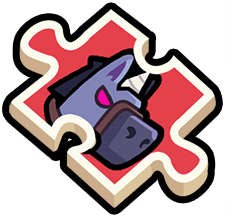

{type=banner}

## 7月活动大事件一览

7月即将到来，本月《弹壳特攻队》可谓猛料不断！不仅有多个高奖励活动轮番登场，**公会探索玩法**迎来史诗级重置，更有玩家万众期待的**四周年庆典版本（v5.0.0）**震撼上线！

为了帮助大家理清资源，提前做好规划，呱呱特意将本月的关键事件和活动节点整理如下，建议大家**截图保存**或**分享给公会小伙伴**哦！

| 关键时间点 | 活动/更新名称 | 活动核心奖励与爆料要点 |
| :--- | :--- | :--- |
| **7月1日 - 7月5日** | **回转大作战** | 经典骰子走格子，公会进度可得S级杰出装备 |
| **7月2日 起** | **公会探索重制** | 全新挂机派遣玩法，S/SP级特工可大幅缩短时长 |
| **7月7日 起** | **欢乐牧场活动 & 激光谐振** | 牧场返场；骨骼湮灭装置(激光态)谐振；新增矿洞挑战券 |
| **7月13日 起** | **女神美食家 & 钻石狂欢** | 美食活动返场；最高 **67500** 钻石狂欢超值礼包 |
| **7月19日 起** | **航海格子铺 & SS腰带神炼** | 格子铺抽奖；SS腰带开启神炼；限定收藏品【回想替身】 |
| **7月21日 起** | **四周年庆典版本** | 四周年版本大更新！新特工、新异宠、新载具及狂欢活动 |
| **7月25日 起** | **彩笔奇妙屋 & 守卫者谐振** | 找线索玩法；骨骼湮灭装置(守卫者态)谐振过载开启 |   
| **7月31日 起** | **幸运扭蛋活动** | 月末狂欢，经典扭蛋抽奖活动返场 |

---

## 7月核心活动与更新详解

### 1. 7月1日：回转大作战活动 {type=icon}

7月开门红活动为**回转大作战**！使用骰子投掷点数在地图中行进，触发特殊格子效果并对Boss造成相应数值的伤害。

**道具单价**：150 {{钻石}}
**初始票数**：5票
**核心奖励**：累计进度可获得神炼核心{{神炼核心}}、末世战马碎片{{末世战马碎片}}以及S级杰出装备自选宝箱{{s杰出装备自选宝箱}}等！
**玩法建议**：本次活动含公会累计进度，需要大家积极参与，可联手公会成员拿到S装自选箱。每日伤害排行榜包含杰出装备宝箱，性价比稍低，建议普通玩家以累计进度为主。

{type=grid3}
{type=grid3}
{type=grid3}

---

### 2. 7月2日：公会探索重置玩法上线 {type=icon}

公会探索将在7月2日迎来全面重制，挂机派遣机制大改版，增加了特定属性特工的提速BUFF，特工稀有度对挂机时长的影响如下：

| 特工稀有度 | 初始派遣时长 | 满星（6星）派遣时长 |
| :--- | :--- | :--- |
| **普通特工** | 6小时 | 4小时30分钟 |
| **S级特工** | 3小时 | 2小时15分钟 |
| **SP级特工** | 6小时 | - |

#### 核心规则解析：
1.  **挂机条件提速**：每个任务都有特定的派遣条件，派遣符合任务特征（如：**男性特工**、**女性特工**、**非人类特工**、**长发特工**、**短发特工**）的特工执行任务，任务耗时可减少 **15%**！
2.  **首领解锁与徽章结算**：全体公会成员累积完成一定挂机任务后将解锁公会Boss。挑战Boss成功即可全员获得**探索徽章**。本公会将根据前 **25** 名成绩出众的特工进行最终奖励结算。
3.  **公会互助加速**：公会成员可点击**加速按钮**，为所有成员 of 公会的离线挂机任务进行提速，注意该功能使用后将进入冷却时间。

---

### 3. 7月7日：欢乐牧场与激光谐振开启 {type=icon}

7月第一个小高峰在7月7日到来：

1.  **欢乐牧场活动返场**：经典休闲养殖玩法返场，玩家可完成任务积攒材料兑换丰厚资源。
2.  **双生配件过载**：双生配件【骨骼湮灭装置(激光态)】开启谐振过载功能，激光武器词条迎来显著增幅。
3.  **矿洞挑战券上线**：即日起，矿洞挑战券可在各大活动中获取。使用一张挑战券即可立即秒通一次矿洞挑战，极大地节省了每日日常的时间！

{type=center;w=180}

---

### 4. 7月13日：女神美食家与超级钻石狂欢 {type=icon}

7月13日起将开启吃货们的福利活动：

1.  **女神美食家活动**：品尝美食、积攒代币兑换各类高级神炼核心和精选配饰。
2.  **惊喜钻石狂欢礼包**：超高返利礼包即将来袭！礼包内包含海量钻石资源：
**普通福利礼包**：共计 **1180** 钻石{{钻石}}
**超级福利礼包**：共计 **45000** 钻石{{钻石}}
**特级福利礼包**：共计 **67500** 钻石{{钻石}}

{type=center;w=180}

---

### 5. 7月19日：航海格子铺与SS腰带异星神炼 {type=icon}

7月中下旬再次迎来装备进阶的大动作：

1.  **航海格子铺活动**：经典格子铺连线玩法，完成连线或拼图可解锁极品S装和觉醒材料。
2.  **SS腰带异星神炼开启**：SS腰带【星辰束腰·创星破灭】将正式开启异星神炼功能，追求极限属性的老玩家们可以开始攒材料了！
3.  **限定收藏品发布**：活动限定收藏品【回想替身】正式登场，为特工们提供常驻攻击与生命加成。

{type=center;w=150}

---

### 6. 7月21日：周年庆版本重磅发布 v5.0.0

四周年庆典版本即将来袭！这将是本年度规模最大的版本更新，爆料内容极其豪华：

**全新特工** 登场
**神火特攻第三弹** 开启 
**全新载具** 与 **全新异宠** 玩法上线
**周年庆重磅福利活动** 开箱子up，白嫖党的狂欢时刻！

*(温馨提示：7月21日为国际服首发更新时间，国服更新发布时间取决于各大应用商店审核进度，预计在此时间左右陆续推送更新！)*

{type=card}

---

### 7. 7月25日：彩笔奇妙屋与转盘谐振 {type=icon}

1.  **彩笔奇妙屋活动**：备受好评的“找线索/翻牌”活动重磅返场。本活动排行榜奖励为高性价比的配件奖励，并且支持玩家并列第一，建议和同组的小伙伴互相控分拿满首位奖励！
2.  **配件过载更新**：双生配件【骨骼湮灭装置(守卫者态)】开启谐振过载功能，增强防护盾的杀伤力。

> **兄弟们，这个活动我有杀手锏，等我攻略！**

---

### 8. 7月31日：幸运扭蛋活动 {type=icon}

7月31日月尾将由**幸运扭蛋活动**压轴。拼人气的扭蛋机返场，通过任务收集扭蛋券即可参与抽奖，包含稀有收藏品和核心宝箱！

{type=grid4}
{type=grid4}
{type=grid4}
{type=grid4}

---

## 呱呱总结与规划建议

7月是《弹壳特攻队》福利拉满的一个月。以下是给各位特工的建议：

**钥匙和钻石存留**：建议大家克制一下，将手中的{{s级军备钥匙}}和大量{{钻石}}资源积攒下来，尽量留到 **周年庆** 期间再进行消耗。钻石不够的可以背包用神炼核心{{神炼核心}}换一些钻石，毕竟周年庆进度活动奖励很不错，很有可能会有{{神炼核心}}的进度奖励。

对于7月份的大事件和活动，大家最期待哪一个？欢迎在下方**评论区留言讨论**，我们下期见！

---

【免责声明】本攻略纯属个人**经验分享**，**仅供参考**，不构成任何消费建议。游戏版本更新较快，具体数值以游戏内实际表现为准。本攻略所引用的美术图片及游戏内截图版权均归 Habby 公司所有。

如果本篇攻略帮到了你，别忘了**点赞和关注**哦！你们的支持是我**更新**的动力！对攻略有疑问？欢迎在**评论区留言**讨论，我会第一时间回复大家，我们下期再见！
