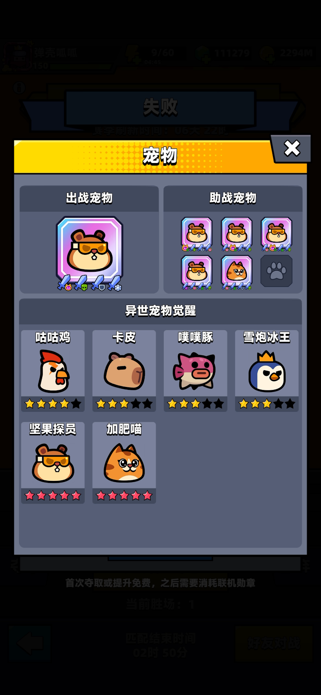
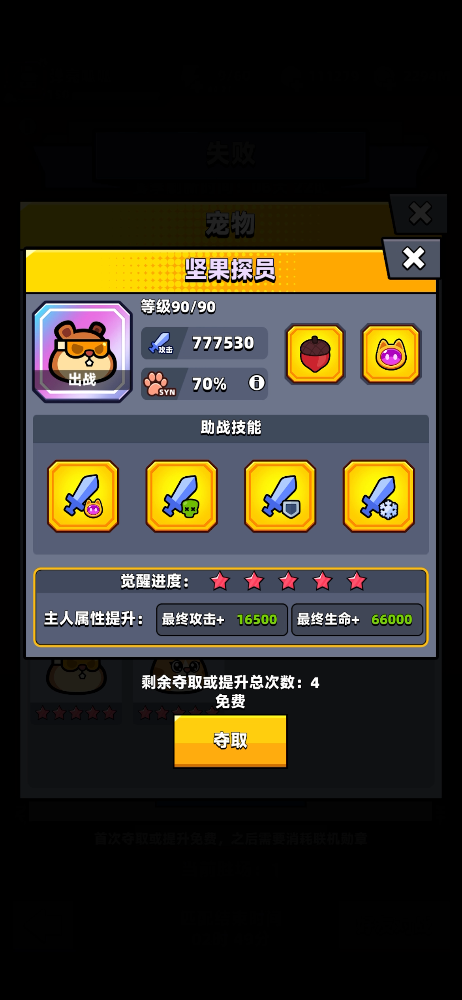
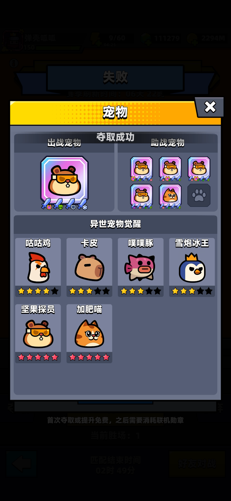
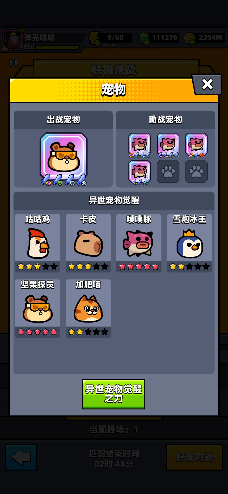
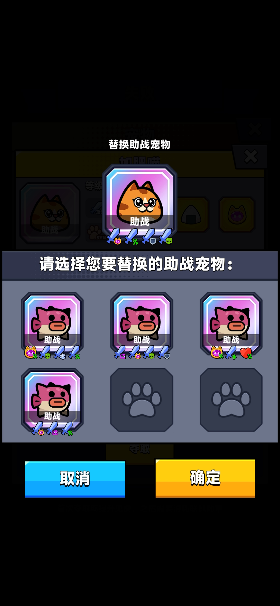
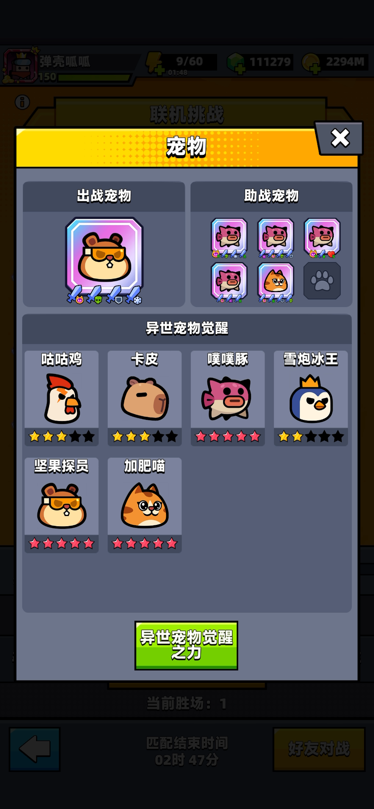

{type=banner}

## 玩法介绍

本次联机挑战迎来重磅更新！为了给大家带来最真实的体验，我专门用了一个 <strong>120万</strong> 攻击（处于中等偏下水平）的账号去进行实测。本以为会被大佬们按在地上摩擦，但由于新赛季在挑战失败后可以**夺取对手的异世宠物**，并引入了**宠物状态锁定**机制，硬是让我靠着夺取大佬的强力宠物实现了逆袭！接下来，我就结合这次实测经历，带大家详细了解具体的规则与体验，感兴趣的话就往下看吧。

---

## 核心机制

### 宠物状态锁定
- **状态锁定**：联机挑战新增锁定**出战宠物**、**助战宠物**、宠物的**觉醒星级**以及**觉醒之力**等级的状态，**S宠物**和**普通宠物**均会锁定。
- **互不影响**：在锁定状态下，联机挑战功能内的宠物状态将**单独计算**。特工在联机挑战功能外替换**宠物**、更改宠物**助战技能**、提升宠物**星级**，均**不会影响**联机挑战功能内的宠物属性计算。

### 宠物夺取规则
1. **品质限制**：联机失败后可以夺取对手的**异世宠物**，**普通宠物不可以**被夺取。
2. **三选一夺取**：夺取时，特工可以在夺取**出战宠物**、夺取**助战宠物**、或者某个**异世宠物**的**觉醒星级**中选择一项。
3. **出战前置条件**：必须要**先有异世宠物出战**。当您没有**异世宠物**作为**出战宠物**时，无法夺取**助战宠物**和**觉醒星级**，必须**优先夺取一个异世宠物作为出战宠物**。
4. **助战位置全解**：**异世宠物**默认**解锁全部助战位置**。夺取**助战宠物**时可任选一个助战位置进行替换，但**不能**用**助战宠物**替换**出战宠物**。
5. **觉醒之力同步**：自动同步（高则更新，低则不变）。夺取**出战宠物**或**助战宠物**时，如果对方宠物的**觉醒星级高于**你**觉醒之力**界面中的宠物星级，则会**同步更新**到对方的星级（若低于则不更新），同时重新计算联机挑战功能内的**觉醒之力**等级。
6. **觉醒星级升降**：**觉醒星级只升不降**。夺取**觉醒星级**后，会同步更新你所有出战和助战宠物中对应宠物的**觉醒星级**。但**无法夺取低于**自己当前觉醒等级的星级。

> 简单来说可以夺取**异世宠物**了，如果没有**异宠**出战先夺取**出战宠物**才能夺取**助战**和**觉醒星级**(没有异宠的号真的不要玩这个模式了信我)。

---

## 夺取选项一览表

| 夺取选项 | 夺取前置条件 | 效果说明 |
| :--- | :--- | :--- |
| **出战宠物** | 无（无**异宠**出战时必选） | 夺取对手的异世出战宠物，覆盖或填补己方出战位 |
| **助战宠物** | 己方出战位必须为**异世宠物** | 任选一个助战位置进行替换，无法替换到出战位 |
| **觉醒星级** | 己方出战位必须为**异世宠物** | 同步更新所有出战和助战中对应宠物的星级（只升不降） |

*(注：夺取宠物时若对方星级更高，**觉醒之力**会自动同步更新。)*

> ⚠️夺取时需要留意宠物技能，必须保留 <strong>3</strong> 个**共鸣增幅**{{共鸣增幅}}，才能保证伤害最大化，其余宠物技能可以根据实际情况替换。
>
> 技能优先级建议：**共鸣伤害**{{共鸣伤害}} > **盾伤**{{盾伤}} > **异伤**（{{冰缓}}{{中毒}}{{衰弱}}） > **攻击力百分比**{{攻击力百分比}}

---

## 备战与夺取建议

建议特工们采取以下应对策略：

* **阵容优先确立**：务必先在**联机界面**确认好当前最强状态再开启挑战。
* **无S宠特工**：若初始没有**异世宠物**，若失败后可以夺取对方的**异世宠物**作为**出战宠物**（新手号尽量不要玩这个模式根据过往经验不太容易拿到 <strong>12胜</strong> 且消耗时间和钻石）。
* **助战快速填满**：**异世宠物**默认解锁全助战位。拥有**S出战宠**后，可在失败时针对性夺取对手的强力助战，快速填满助战格。
* **觉醒之力夺取**：阵容完善后，夺取目标应锁定为“**觉醒星级**”，利用“只升不降”的机制夺取所有**异世宠物**全部满星。

> ⚠️新手号尽量不要玩这个模式,实测下来还是比较难打的,钻石和时间都白白浪费了。

---

## 实际体验

当对战失败后点击对方的宠物，可以看到**出战宠物**、**助战宠物**以及**觉醒星级**，再次点击后可以选择夺取。
对方的宠物面板，如下图所示：
{type=card}

这是一个双 <strong>5</strong> {{红星}}的大佬号，看起来还挺强的，我们看一下具体情况：
我先夺取了他的出战宠物**松鼠**{{松鼠}}，点击他的出战宠物**松鼠**可以看到如下界面：
{type=card}

点击夺取，显示夺取成功，直接替换我的**出战宠物**。
{type=card}

可以看到我的**出战宠物**被替换成了**松鼠**{{松鼠}}，同时**觉醒星级**也同步更新了。
{type=card}

接着点击助战位置上的**加肥喵**{{加肥喵}}，显示出自己的助战宠物槽，这时候可以点击任意一个位置进行替换，我选择倒数第二个空的槽位，最后一个目前还没有开通。
{type=card}

点击后显示夺取成功：
{type=card}

回到我的宠物面板看一下，我的**助战宠物**变成了**加肥喵**{{加肥喵}}，**觉醒星级**也同步更新了。
{type=card}

目前我已经有 <strong>3</strong> 个 <strong>5</strong> {{红星}}的宠物了，接下来再夺取的话就是把剩下的宠物都夺取为 <strong>5</strong> {{红星}}。

---

## 总结

以上就是本次夺取异宠玩法的详细介绍啦，我目前测试下来 <strong>120万</strong> 攻击的号实际拿到 <strong>12胜</strong> 依旧并不容易，我打了几局下来还是很难赢的也不知道是不是和赛季初竞争激烈的原因，大家也快去试试吧，欢迎在评论区留言讨论哦。

【免责声明】本攻略纯属个人**经验分享**，**仅供参考**，不构成任何消费建议。游戏版本更新较快，具体数值以游戏内实际表现为准。本攻略所引用的美术图片及游戏内截图版权均归 Habby 公司所有。

如果本篇攻略帮到了你，别忘了**点赞和关注**哦！你们的支持是我更新的动力！对攻略有疑问？欢迎在**评论区留言**讨论，我会第一时间回复大家，我们下期再见！