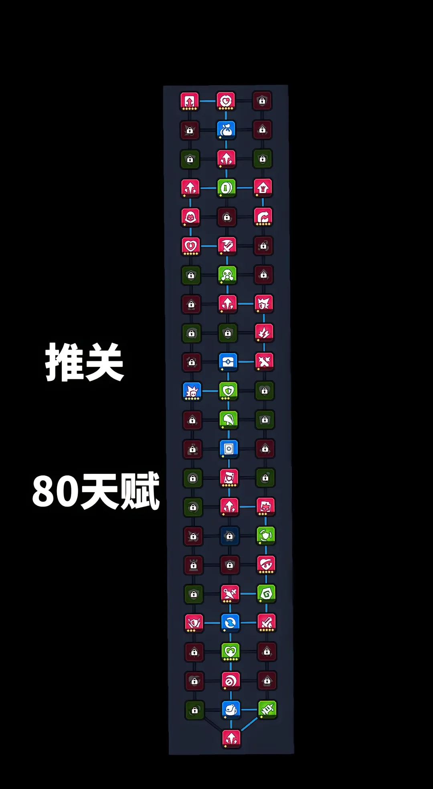
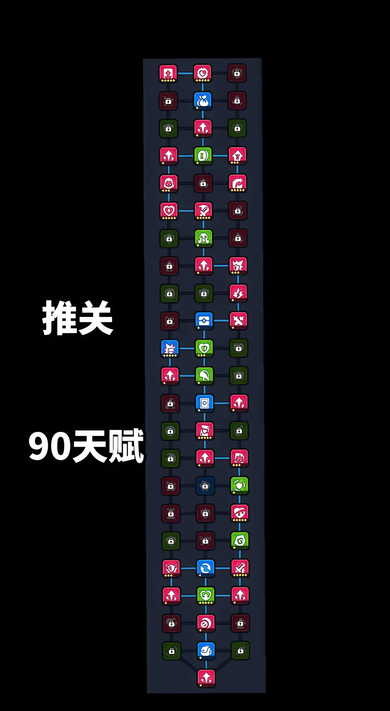
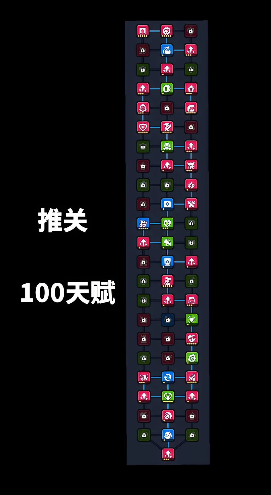
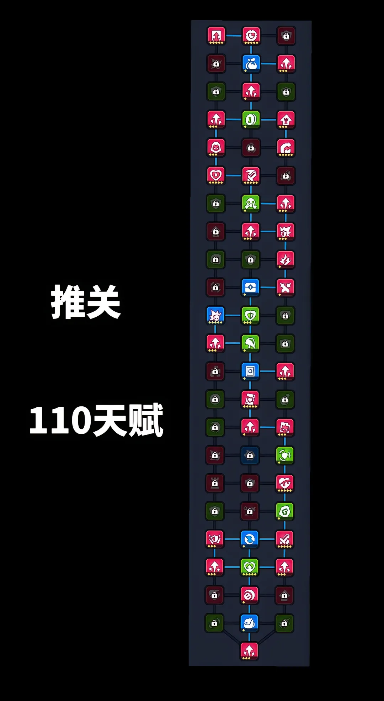
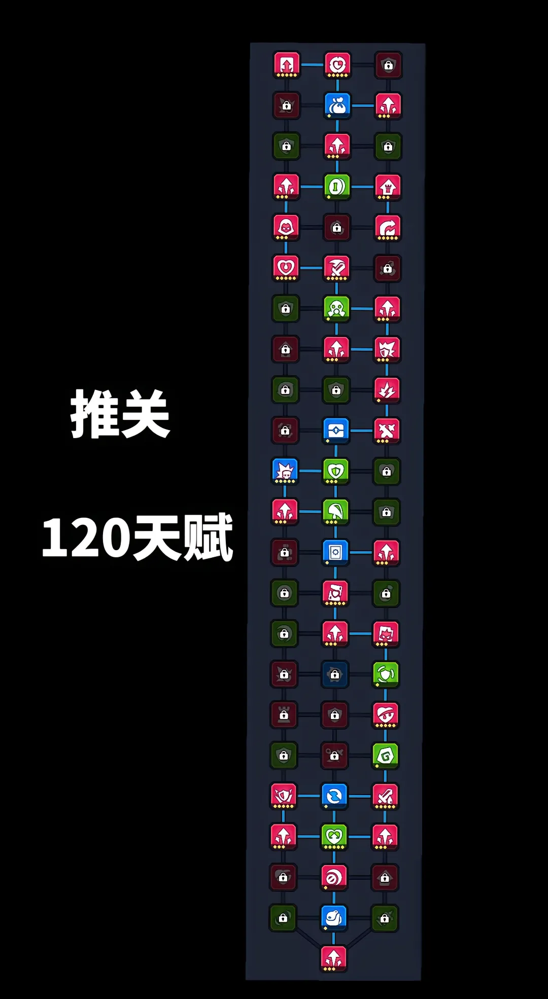
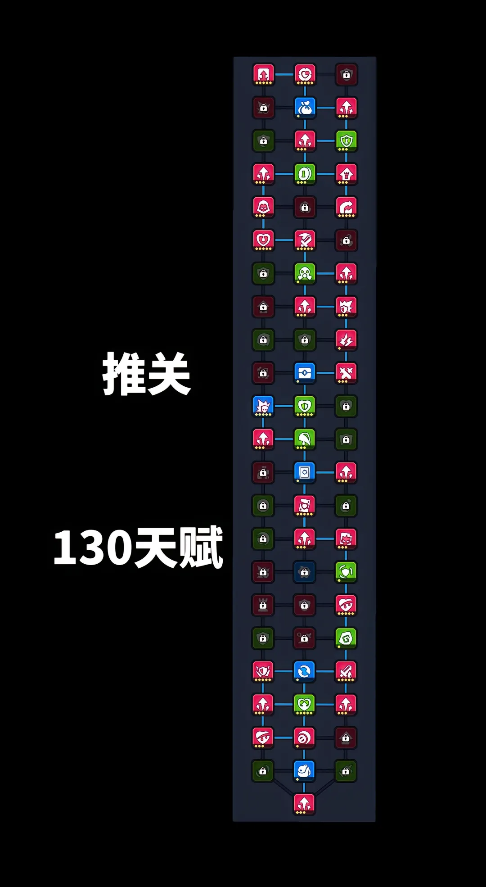
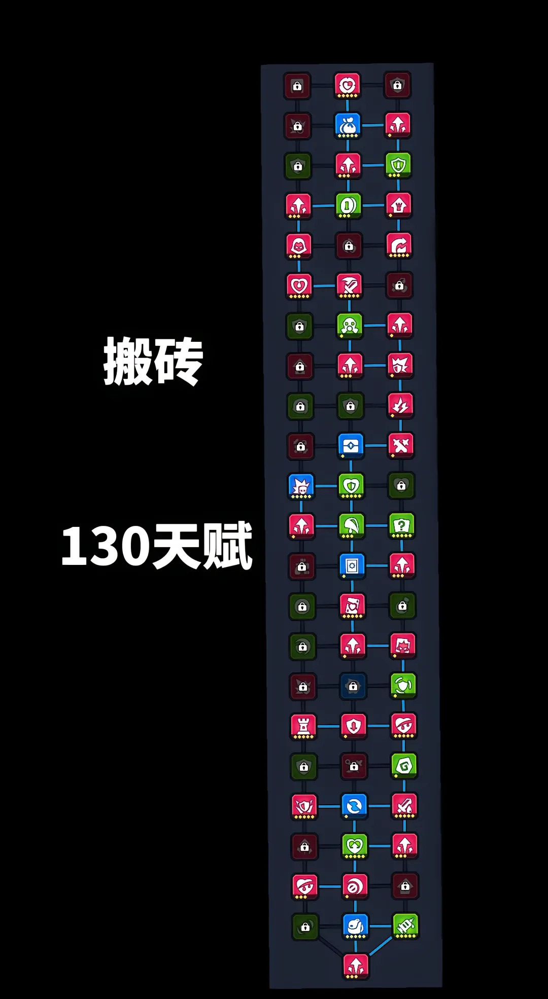

{type=banner}

## 介绍

为什么别人玩《逃离行动》轻松搬砖，你却卡在神话难度怎么也过不去？问题就出在你的**天赋选择**上！

今天给大家带来这套在抖音被 **16万** 玩家看过的 **80-130 个天赋加点图**，还有大佬都在用的**搬砖加点**全公开！跟着这套加点走，最快 **2天** 即可轻松毕业，赶快来抄作业吧！

---

## 天赋加点（80-130点）

以下是针对不同等级阶段整理的推关加点路线图，建议直接抄作业：

### 1. 80点 推关天赋
{type=card}

> 💡 上赛季打满200天赋，按百分之40继承，自动获得80点天赋

### 2. 90点 推关天赋
{type=card}

### 3. 100点 推关天赋
{type=card}

### 4. 110点 推关天赋
{type=card}

### 5. 120点 推关天赋
{type=card}

### 6. 130点 推关天赋
{type=card}

### 7. 130点 搬砖天赋
{type=card}

---

## **核心天赋解析：**
- **肉山**: 最大生命值 +80%，技能伤害 +60%
- **高能过载**: 护盾增伤 + 30%
- **血巨人**: 每50点生命，攻击 +1%, 最大 +40% 
- **献血**: 护盾上限固定为 30%，生命越低，获得额外技能伤害越高，最多 +150%
- **悬赏令**: 每击杀一个首领或精英怪，造成伤害 +5%,最大 +15%
- **孤注一掷**: 生命小于30%时，造成伤害+50%,受到伤害+50%
- **再生**: 若1秒内未受到伤害，每秒恢复 2% 血量，造成伤害 +15%（这个天赋可以很好的触发天赋“转化”的效果,两者通常搭配起来使用）
- **反向保护**: 护盾增伤 +60%
- **凌弱**: 进入首领战斗时，暴击率提升20%
- **双刃剑**: 使用s武器每击杀1个怪物可获得1层效果：造成伤害 +0.2%,最多100层,但每次受到伤害 -5 层效果。（比较依赖走位，需要一定熟练度）
- **护盾强击**: 拥有护盾时，技能伤害 +30%
- **圣剑**: 使用s武器时，造成伤害 +20%
- **舍身**: 护盾固定为30%，生命小于 30%,造成伤害 +45%。
- **堕落**: 每获得1个诅咒，造成伤害 +3%,最多3层 + 15%
- **转化**: 无法恢复生命，但触发生命恢复时，提升 90% 技能伤害。（需要依赖"再生"这个天赋点才能发挥其效果，否则局内就要捡到回血的技能）
- **割肉**: 护盾上限固定为 30%，开局初始生命值为 30%；生命值小于 50%时，造成伤害 +30%
- **高端玩家**: 难度每提升一次，技能伤害 +10%,无上限（想要连续推关必点满的核心天赋）

---

## Q&A

**问**: 为什么你们开局就有80个天赋点？
**答**: 继承的，上赛季打满200天赋，按百分之40继承，自动获得80点天赋

**问**: 天赋点为什么不掉落了？
**答**: 每天的上限10个可累积，共200个，达到其中一个条件都不会再掉落

**问**: 为什么你们开局就残血？
**答**: 这是因为我们点了天赋**割肉**的缘故。（能问出这个问题的肯定是没好好看天赋词条该打）

**问**: 超过 130 个天赋点怎么办？
**答**: 不知道怎么点的就点**核心力量**多加点攻击力总没错的

**问**: 到底用什么装备？
**答**: 无非两种武器：**苦无**和**混乱之剑**{{混乱之剑}}，主要是看你天赋，前期推关没有拿到**混乱剑**就用苦无，天赋点也要点到加苦无伤害，等拿到混乱剑了就一直用混乱剑就好了，这两种武器都可以锁定boss这是他们的一个特点

**问**: 技能怎么搭配?
**答**: 我自己用的技能是：**无人机**{{无人机}}、**足球**{{足球}}、**哨箭**{{哨箭}}、**雷电**{{雷电}}、**转盘**{{转盘}}(仅供参考，不一定对)

**问**: 哪个难度搬砖最合适？
**答**: 梦魇一（因为梦魇出红的爆率高，而且梦魇一掉落红装备的概率较低不会稀释红收藏品。）

**问**: 无人机怎么总是合成不了？
**答**: 无人机需要用两个技能栏合成，所以前期要留好技能栏给无人机。如果技能栏被占了无人机是不会来的

---

## 总结
以上就是《弹壳特攻队|逃离行动》 **80** 到 **130** 天赋加点图啦！大家目前都在用哪套加点？或者你已经毕业通关了？欢迎在下方评论区留言讨论！

【免责声明】本攻略纯属个人**经验分享**，**仅供参考**，不构成任何消费建议。游戏版本更新较快，具体数值以游戏内实际表现为准。本攻略所引用的美术图片及游戏内截图版权均归 Habby 公司所有。

如果本篇攻略帮到了你，别忘了**点赞和关注**哦！你们的支持是我更新的动力！我们下期再见！
